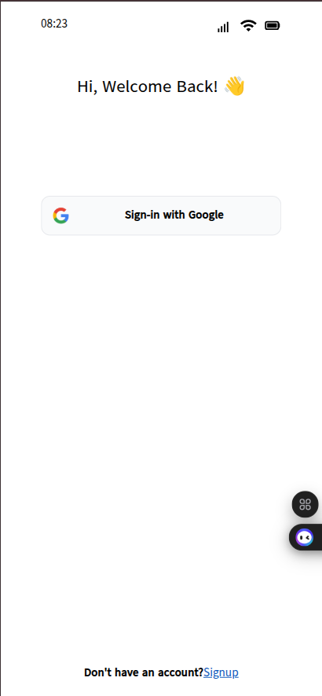

# To-Do List App with React and Tailwind CSS

Welcome to the **To-Do List App** repository! This project is a simple yet powerful to-do list application built using **React**, **Typescript** and **Tailwind CSS**. It includes features like a calendar, year filter, modal, local storage integration, and more. The app is designed without relying on any external component libraries, ensuring a lightweight and customizable experience.

  
[Live Demo](https://oway-todolist.vercel.app)

## **Features**

✅ **Add, Edit, and Delete Tasks**: Easily manage your tasks with intuitive controls.
✅ **Calendar Integration**: View tasks on a calendar for better organization.
✅ **Year, Month, Day Filter**: Filter tasks by year, month, day to focus on specific timeframes.
✅ **Modal for Task Details**: View and edit task details in a clean modal.
✅ **Local Storage**: Save your tasks locally so they persist even after closing the browser.
✅ **Context API**: Manage global state efficiently using React's Context API.
✅ **TypeScript**: Strongly typed code for better maintainability and fewer runtime errors.
✅ **Custom Components**: Built entirely without external component libraries for full control over styling and functionality.

## **Technologies Used**

- **React**: A JavaScript library for building user interfaces.
- **TypeScript**: A strongly typed superset of JavaScript for scalable applications.
- **Tailwind CSS**: A utility-first CSS framework for rapid UI development.
- **Context API**: For global state management.
- **Local Storage**: To persist tasks in the browser.

---

## Installation & Setup

1. **Clone the repository**
   ```sh
   git clone https://github.com/your-username/todo-list-app.git
   cd todo-list-app
   ```

2. **Install dependencies**
   ```sh
   npm install
   ```

3. **Start the development server**
   ```sh
   npm run dev
   ```

4. **Open in browser**  
   Navigate to `http://localhost:5173/` in your browser.

## Folder Structure
```
📂 public
📂 src
 ┣ 📂 assets      # Store image, css and font
 ┣ 📂 components  # Reusable UI components
 ┣ 📂 context     # Context API for state management
 ┣ 📂 hooks       # Custom hooks
 ┣ 📂 layout      # Project layout
 ┣ 📂 pages       # Application pages
 ┣ 📂 routes      # Routing system
 ┣ 📂 types       # Typescript's ype declaration
 ┣ 📂 utils       # Utility functions
 ┣ 📜 App.tsx     # Main application file
 ┣ 📜 index.tsx   # Entry point
package.json
```

## Contributing
Feel free to contribute to this project! Fork the repo, make your changes, and submit a PR.

## License
This project is open-source and available under the [MIT License](LICENSE).

---
✨ **Built with love using React, TypeScript & Tailwind CSS** ✨


